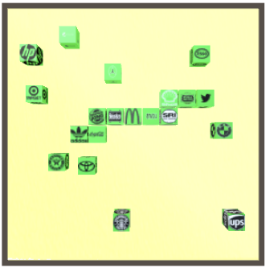
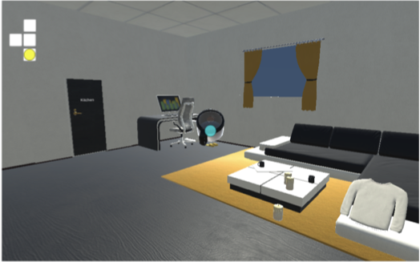
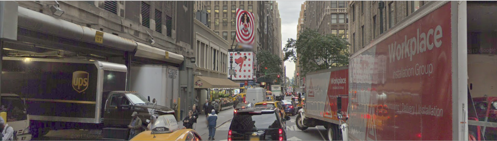

# Cornell Instruction Following Framework (CIFF)

An agent following an instruction given to it by a human in natural language has remained one of the long standing goals of Artificial Intelligence going back to the work of [SHRLDU (Winograd 1968)](https://en.wikipedia.org/wiki/SHRDLU). In the last decade, several different datasets, learning environments have been released by different research groups (SAIL, LANI, Blocks, CHAI, etc.) however evaluating agents on all of them has been difficult due to different interfaces, format and configuration. This adds an unnecessary amount of engineering and as a result most research papers on instruction following evaluate on a single dataset (generally developed by their research group).

CIFF is intended to remove this unnecessary engineering work by providing an integrated framework for developing and experimenting with various natural language instruction following framework. Currently it provides a common interface for 4 datasets and simulators, several models and learning algorithm.

## CIFF Features

Contains simulators and dataset for 4 domains for natural language instruction following: 

 |    
--- | --- 
Block World Dataset (Bisk et al. 2016) | LANI (Misra et al. 2018)
--- | ---
  |  
--- | --- 
CHAI (Misra et al. 2018) | Touchdown (Chen et al. 2018)

The code contains experiments for training and testing various models and baselines including:

      a) Simple baselines like stop, random baseline and most frequent action.

      b) Models like Misra et al. 2017, Gated Attention Chaplot et al. 2017, Misra et al. 2018 etc.
        
      c) Training algorithms like Behaviour Cloning, A3C, Reinforce. We also provide asynchronous learning allowing training on several different environments simultaneously. 

Our code is built using [PyTorch](https://pytorch.org/) which is a popular Deep Learning library for development and allows dynamic graph building and GPU functionalities. We also provide additional logging facilities, a tensorboard class for visualization and reading hyperparameters and configurations from JSON files.

**Dataset and Simulators:** Dataset and simulators for Blocks, LANI and CHAI are available here: http://clic.nlp.cornell.edu/resources/Misra-EMNLP-2018/
   
 Test scripts for visualizing the dataset and simulators will be available on the wiki soon.

**Note**: Touchdown dataset uses Google Streetview images that are owned by Google. Please see the Section 9 in the Touchdown paper for details on how to get access to the dataset.

**Code Status:** An unstable release is available currently. Please follow issues for details on fixes left to be done. For any questions email Dipendra Misra at dkm@cs.cornell.edu. 

**Credits**

Maintained by: Dipendra Misra (dkm@cs.cornell.edu)

Researchers and Developers: Dipendra Misra, Andrew Bennett, Max Shatkin, Eyvind Niklasson, Howard Chen, Valts Blukis, and Yoav Artzi

## Publications

Publications using models, data or simulators provided with CIFF.

1) Touchdown: Natural Language Navigation and Spatial Reasoning in Visual Street Environments *Howard Chen, Alane Suhr, Dipendra Misra, Noah Snavely, Yoav Artzi*, [arXiv 2018](https://arxiv.org/pdf/1811.12354.pdf)  (Uses CIFF for navigation baselines)

2) Mapping Navigation Instructions to Continuous Control Actions with Position Visitation Prediction *Valts Blukis, Dipendra Misra, Ross A. Knepper, and Yoav Artzi*, [CoRL 2018](http://www.cs.cornell.edu/~dkm/papers/bmka-corl.2018.pdf) (Uses only the LANI dataset and simulator.)

3) Mapping Instructions to Actions in 3D Environments with Visual Goal Prediction *Dipendra Misra, Andrew Bennett, Valts Blukis, Eyvind Niklasson, Max Shatkhin, and Yoav Artzi*, [EMNLP 2018](https://arxiv.org/abs/1809.00786)

4) Scheduled Policy Optimization for Natural Language Communication with Intelligent Agents, *Wenhan Xiong, Xiaoxiao Guo, Mo Yu, Shiyu Chang, Bowen Zhou, William Yang Wang*, [arXiv 2018](https://arxiv.org/abs/1806.06187) (Uses only the Blocks simulator)

5) Reinforcement Learning for Mapping Instructions to Actions with Reward Learning, *Dipendra Misra and Yoav Artzi*, AAAI Fall Symposium on Natural Language Communication for Human Robot Interaction. [Paper](http://www.ttic.edu/nchrc/papers/19.pdf)

6) Mapping Instructions and Visual Observations to Actions with Reinforcement Learning, *Dipendra Misra, John Langford and Yoav Artzi*, EMNLP 2017. [Paper](http://www.cs.cornell.edu/~dkm/papers/mla-emnlp.2017.pdf)

## How to Use CIFF

1) Clone the repostory using `git clone https://github.com/clic-lab/instruction-following-framework.git`

2) Download the data and simulators file from http://clic.nlp.cornell.edu/resources/Misra-EMNLP-2018/. Note that images for Touchdown dataset are not available publically since Google owns these images. We do however provide image features. Please see the Section 9 in the Touchdown paper for full details. Place the data and simulator files in the same ciff folder alongside the src folder. Your directory structure should look like:

- ./ciff/

     - data
     
     - simulators
     
     - src
     
3) Set PYTHONENV to treat the src folder as root. One way to do this is to run:
 
   `export PYTHONPATH=$PYTHONPATH:./src/`

4) Run an experiment. This is essentially done by running a file as:

   `python3 src/experiment_domain_name/experiment_name.py`

   where `domain_name` is the name of the domain (e.g., nav_drone for LANI, house for CHAI, streetview for touchdown, blocks for blocks) and `experiment_name` is the name of the experiment you want to run.

For details on experiments see the [Wiki](https://github.com/clic-lab/ciff/wiki).
